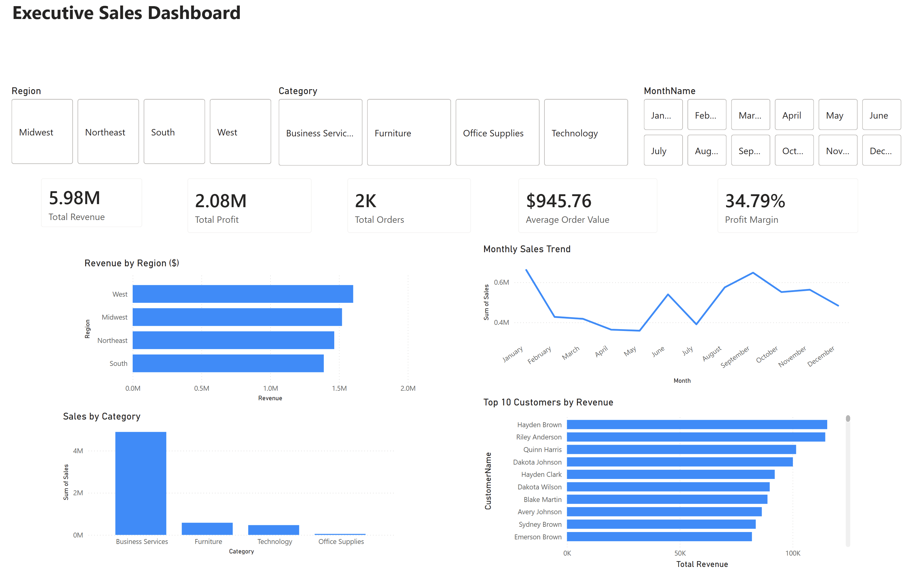
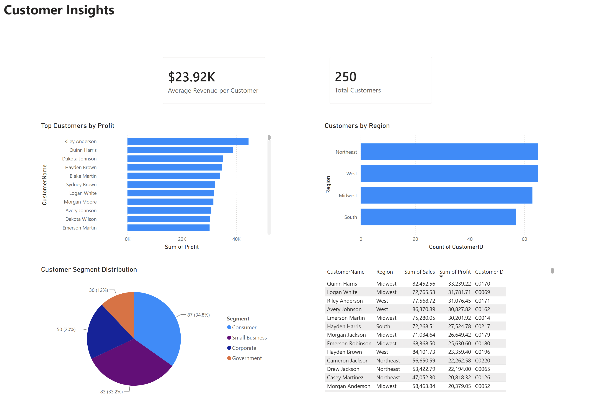

# Executive Sales Dashboard & Customer Insights Dashboard

## Overview

This project consists of two interactive dashboards built using Microsoft Power BI to analyze executive sales performance and customer insights.

The dashboards leverage KPI cards, DAX measures, and interactive visualizations to support data-driven business decision-making.

## Dashboard Features

### Executive Sales Dashboard
- Revenue by Region
- Sales by Category
- Monthly Sales Trends
- Top Customers by Revenue
- Interactive Slicers

### Customer Insights Dashboard
- Average Revenue per Customer
- Total Customers
- Customer Segmentation Analysis
- Customer Profitability Analysis
- Regional Customer Distribution
- Customer Details Reporting

## Tools & Technologies
- Microsoft Power BI
- DAX
- Microsoft Excel

## Skills Demonstrated
- Business Intelligence
- Data Analysis
- Data Visualization
- Dashboard Development
- KPI Reporting
- Customer Analytics
- Business Analytics

## Project Assets
- Executive_Sales_Dashboard.png
- Customer_Insights_Dashboard.png
- PowerBI_Executive_Sales_Dashboard_Demo.mov

## Author

Markell Mitchell

BSBA, Management Information Systems  
Oklahoma State University

## Dashboard Screenshots

### Executive Sales Dashboard

### Customer Insights Dashboard

## Demo Video

[Watch Dashboard Demo](PowerBI_Executive_Sales_Dashboard_Demo.mov)
